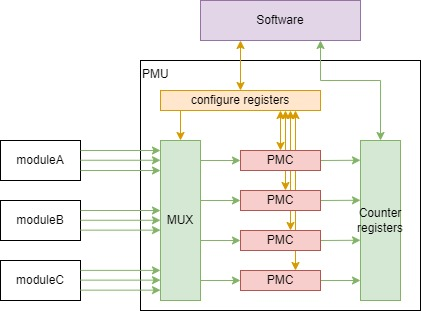
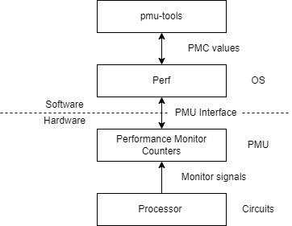

# Intel Top-down详解 之 综述

Top-down方法学由Intel提出，是一种软件性能分析技术。在众多软件性能分析技术中，Top-down使用了最多的硬件信息，与处理器微架构设计关系最为密切。目前，Top-down方法学已经成为服务器领域进行软件性能分析的标准方法之一。

## Top-down方法学

### 从PMC说起

性能监视计数器（Performance Monitor Counter，PMC）是软件工程师获取处理器运行方式最重要的手段。

在处理器设计阶段，会在CPU内部埋设众多性能监视信号。这些信号负责监视处理器中各种各样的事件，比如Cache缺失、TLB缺失、分支预测错误、各种指令的发射（issue）和退休（retire）等等。通常情况下，一种事件的性能监视信号只有1比特的电平信号（不需要握手）。当监控的事件发生时，信号置1（或置0）；监控事件结束之后，信号置0（或置1）。

性能监视计数器的软件接口通常会被称为性能监视单元（Performance Monitor Unit，PMU）。处理器中各个地方的性能监视信号都要汇集到PMU上。



在PMU中会提供几个性能计数器。每个性能计数器都提供可读写的配置寄存器和可读的值寄存器。配置寄存器可以为PMC选择需要计数的监控信号，以及计数的模式和过滤器。比如，对于提供了SMT功能的处理器，可以配置为统计两个线程的事件或者只统计其中一个线程的事件。

对于一个PMU来说，能够同时监控的事件是很少的。x86处理器的PMU一般提供8个PMC，其中4个是固定的PMC，其对应的监控信号是不能配置的。另外4个PMC监控的信号是可以配置的。

在多核处理器SoC中不只存在一个PMU。实际上，每个处理器核心Core都有自己独立的PMU，而且有时核外的存储系统和外设也会提供自己的PMU。

### 通过PMC分析性能

通过PMC，软件工程师可以获得处理器中各种事件（指令数量、分支预测错误、Cache缺失等）发生的数量。基于这些事件，软件工程师可以窥探处理器的行为。

- 首先，软件工程师可以通过PMC获得程序执行的时钟周期。在X86中，时钟周期是固定PMC之一。
- 接着，软件工程师可以通过PMC获得各种类型指令（访存、分支、整形计算、浮点计算、向量计算等）的执行次数。
  - 不同于软件的静态分析，这里可以获得真正执行时的指令混合（Instruction Mix）情况。可以初步反映程序热点所在。
  - 另一方面，通过PMC可以进一步获得微指令（micro-op）的指令混合情况，这更加接近处理器的真实负载比例。
  - 更近一步，通过PMC可以获得投机执行的指令（无法退休的指令）的占比。
- 然后，软件工程师可以通过PMC获得各种可能使得流水线stall的事件的次数。
  - 流水线stall表示处理器无法给执行单元提供指令。
  - 典型的会引起流水线stall的事件包括：Cache缺失、TLB缺失、分支预测错误、发射端口不足、乱序资源不足等。
  - 对于顺序执行以及单发射的处理器中，可以通过累加上述事件以及他们引入的stall的周期的乘积，就可以估计流水线stall的总数。

为了提高性能，现代处理器充分利用超标量、乱序执行和投机执行。这就造成了孤立的统计指标无法反映程序整体性能瓶颈的问题。具体表现为：

- 超标量误差。在顺序执行以及单发射的处理器中，一种stall事件就会引起整个流水线的stall。但是在超标量处理器中，由于处理器可以同时发射或处理多条指令，一条指令遇到stall事件并不意味着整个流水线stall。这就使得单纯统计数量并不能正确反映流水线stall的情况。
- 可能引起流水线stall的事件会出现重叠。比如处理器的前端和后端可能在同时出现stall行为，此时两个事件引起的stall效果重叠在一起。类似的还有寄存器依赖关系和访存依赖关系引起的stall会重叠等。
- 投机执行。由于投机执行的指令并不是真正需要执行的指令，因此投机执行的代码常常会引入更多的stall。这些stall都应该表征在投机行为上，而不是表征在对应的事件上。

以上这些误差都会影响通过PMC对于软件性能瓶颈的定位，使得定位出现偏差。综上，Top-down方法学最为重要的动机就是为现代处理器提供一个更加准确的性能分析方法。

### Top-down方法学

根据论文“”

> Top-down方法学的目的是正确而高效的确认性能瓶颈。Top-down方法学指导软件工程师关注到真正重要的问题。

> Top-down方法学首先在高层次分类CPU的执行时间。从这里可以获得需要进一步分析的领域。然后，用户可以进入到值得关注的领域，并且忽略其他领域。按照层次结构重复这一个过程，直到确定特定的性能问题，或者将潜在问题确定在很小的范围内。

个人理解，Top-down方法学的关键词是“饼图”或“层次化”。Top-down首先在微架构中寻找一个可以量化的观测点，并且确定一种分类单位（时钟周期、Slot或带宽等）。然后对选定的单位进行分类，得到各分类的占比，形成“饼图”。比如时钟周期是空闲还是被使用。对于得到的一个分类，既可以继续细化分类，也可以重新选择观察点和单位，再进行分类。从而形成层次化架构（或者决策树）。

在Top-down方法学的第一层，将观察点设置在流水线中顺序执行部分和乱序执行部分的分割点，具体位置在从译码单元到寄存器重命名单元（RAT）的位置。在这个位置之前，指令（或微指令）按照程序执行顺序在流水线上流动；在这个位置之后，指令（或微指令）的流动受到乱序执行引擎的影响，比如乱序缓存资源不足、寄存器依赖关系未满足、地址依赖关系未解除等。

对于超标量处理器，在RAT位置的入口都可以并行发送多条指令。直接使用周期作为分类单位会引起超标量误差。Top-down方法学在这里选择slot作为分类单元。slot表示的是一个周期传递的一条微指令，slot总量是前端并行宽度和执行周期的乘积。

slot的分类如下图。根据slot是否被微指令占用可以分为两类。对于被微指令占用的slot，可以进一步按照指令是否投机执行进行区分为retiring和bad-speculation。没有被微指令占用的slot，可以进一步按照造成空闲的原因，区分为frontend-bound和backend-bound。

由于前面提到的乱序和投机等问题，一个单位可能具备同时属于多个分类的可能。比如说，当流水线stall的时候，前端和后端可能同时处于stall状态（比如，前端由于L1指令缓存缺失而无法给后端提供指令，后端因为L1数据缓存缺失而无法接受前端的指令），此时，我们需要根据经验给出倾向性的判断，从而保证一个单位只能归类到一种类型。比如，Intel认为当前端和后端stall同时出现时，认为是后端stall，因为在现有处理器中后端stall更加重要。这种“强制性”的分类是根据大量的软件分析以及对于微架构演进方向的展望做出的，在绝大多数情况下都是可以信任的。

Top-down方法学不仅适用于Top-down第一层这样的架构（宏观）分析，也可以适用于微架构分析。比如分析执行单元的利用率，可以将时钟周期为分类单元，按照周期中发射的操作数量进行分类，分为未发射操作给执行单元；发射1个、2个或n个操作给执行单元。分析存储单元的带宽，可以将带宽作为分类单元，按照带宽的使用原因来分类，分为load使用的、store使用的、refill使用的以及evict使用的。

## Top-down工具pmu-tools

Intel Top-down工具称为[pmu-tools](https://github.com/andikleen/pmu-tools/tree/master/jevents)。pmu-tool只用于Linux操作系统（因为需要调用Linux系统的Perf工具）。pmu-tool以python3开发，不需要安装。clone代码后可以直接执行。



Intel的性能分析工具集Vtune也集成了Top-down工具。不过因为Vtune是付费软件，这里就不考虑了。

### 工具使用

### 调用Perf

top-down工具利用perf获取指令的最底层信息。Perf是linux平台的性能测试工具，功能非常强大。其中最为常用的功能包括：

- `perf record`和`perf report`报告程序各函数执行的时间占比，从而定位程序热点。
- `perf stat`获取程序执行阶段的硬件PMC的数值。

top-down工具就是利用`perf stat`来获取PMC数量的。工具会根据目标CPU生成需要监控的PMC列表，然后利用`perf stat`获取这些PMC的数值。

top-down使用的PMC数量非常多，但是硬件提供的PMC接口却很好。同一时刻，硬件只能对4个PMC进行计数。为此，`perf stat`将执行时间进行分段，轮询监控PMC。首先监控PMC列表开始的4个PMC，一段时间后切换到后面4个PMC。程序运行结束后，在根据监控PMC的时间和总的执行时间，对于统计到的PMC计数进行缩放。

```
final_count = raw_count * time_enabled/time_running
```

因此，利用top-down工具进行分析时，程序执行时间不能太短，否则会出现无法统计到所有PMC的情况。

### 度量指标

pmu-tool中定义了top-down方法学需要测量和分析的度量指标（metrics）。这些度量指标对硬件性能计数器结果进行计算，得到更加形象和有针对性的指标。比如度量`Metric_L1MPKI`表示每千条指令中，L1缓存缺失的次数。计算公式如下：

```
Metric_L1MPKI = 1000 * MEM_LOAD_RETIRED.L1_MISS / INST_RETIRED.ANY
```

公式中，MEM_LOAD_RETIRED.L1_MISS和INST_RETIRED.ANY都是硬件PMC，分别表示发生L1缓存缺失的非投机的load指令数，以及所有非投机的退休指令数。

pmu-tool中使用的度量（metrics）可以分为决策树和微架构度量两部分。决策树部分用来定位性能瓶颈，比如`Frontend-Bound`、`Backend-Bound`、`Retiring`和`Bad-Speculation`。决策树部分的metric遵循top-down方法学分层设置。每一层的metric之间需要满足互斥关系，并且加和不大于1且不大于上一级度量指标。

在完成决策树定位之后，可以通过微架构度量进一步分析性能瓶颈产生的原因。微架构度量部分的metric相互之间没有约束关系，软件工程师需要判定这些metric的绝对值，以寻找性能缺陷。

### metric数据库

pmu-tool中的metric定义一共有三个版本，代码中称为V1.0，V2.0和V4.5。新增加的处理器选择那个版本并不是完全取决于处理器发布的时间顺序，而是取决于处理器架构的延续脉络。每一个版本中又包含了针对不同微架构的定义，随着微架构的发展，针对不同微架构的metric定义会增加新的度量，或调整度量的公式。

V1.0属于极简版，应用于Silvermont和Knights Landing微架构。V1.0只提供了3级决策树（10个度量指标）和6个通用度量指标。

- "slm"代表Silvermont和Airmont微架构，属于凌动系列小核处理器。
- "knl"代表Knights Landing，第二代PHI计算卡中的处理器架构，其中使用了72个Silvermont核心。

V2.0属于精简版，应用于Elkhart Lake和GraceMont微架构。V2.0提供了4级决策树（总共38个度量指标）和45个通用度量指标。

- "ehl"代表Elkhart Lake微架构，也称为Tremont，也属于凌动系列的架构。
- 在V2.0版中，"adl"代表Gracemont和Enhanced Gracemont微架构，分别作为Alder Lake/Raptor Lake能效核心（小核）微架构。Gracemont是Tremont的后继架构。

V4.5是目前主要的版本，应用于以下微架构：

- Core系列：从第二代酷睿开始的所有架构。目前支持到Raptor Lake。
  - "snb"代表Sandy Bridge微架构，用于第二代酷睿处理器。
  - "ivb"代表Ivy Bridge微架构，用于第三代酷睿处理器。
  - "hsw"代表Haswell微架构，用于第四代酷睿处理器。
  - "bdw"代表Broadwell微架构，用于第五代酷睿处理器。
  - "skl"代表Skylake、KabyLake、CoffeeLake、Whisky Lake、Amber Lake和Comet Lake微架构，用于第六、七、八、九代酷睿处理器。
  - "icl"代表Ice Lake和Rocket Lake微架构，用于第十、十一代酷睿处理器。
  - "tgl"代表Tiger Lake微架构，用于第十一代酷睿处理器。Tiger Lake和Ice Lake共享相同的top-down设计。
  - 在V4.5中，"adl"代表Golden Cove和Raptor Cove微架构，分别作为Alder Lake/Raptor Lake性能核心（大核）微架构。用于第十二、十三代酷睿处理器。
- Xeon系列：
  - "jkt"代表Sandy Bridge微架构，用于Xeon E3-1200系列，Xeon E5-2400/1400系列，Xeon E5-4600/2600/1600系列，Xeon E7-8800/4800/2800系列。
  - "ivt"代表Ivy Bridge微架构，用于Xeon E5-2400/1400 v2系列，Xeon E5-4600/2600/1600 v2系列，E7-8800/4800/2800 v2系列。
  - "hsx"代表Haswell微架构，用于Xeon E3-1200 v3系列，Xeon E5-2600/1600 v3系列。
  - "bdx"代表Broadwell微架构，用于Xeon D-1500系列和Xeon E5 v4系列。
  - "skx"代表Skylake微架构，用于Xeon可扩展处理器和Xeon E3-1500m v5系列。
  - "clx"代表Cascade Lake和Copper Lake微架构，用于第2代Xeon可扩展处理器。
  - "icx"代表Ice Lake微架构，用于第3代Xeon可扩展处理器。
  - "spr"代表Sapphire Rapids微架构，用于第4代Xeon可扩展处理器。

V4.5提供了4级决策树（总共109个度量指标）和118个通用度量指标。与V2.0的决策树相比，V4.5的决策树在第3、4级有非常明显的区别。此外，V4.5也存在Core微架构和Xeon微架构两条演进路线。相对于对应的Core微架构版本，Xeon路线主要加强了uncore部分的决策。
